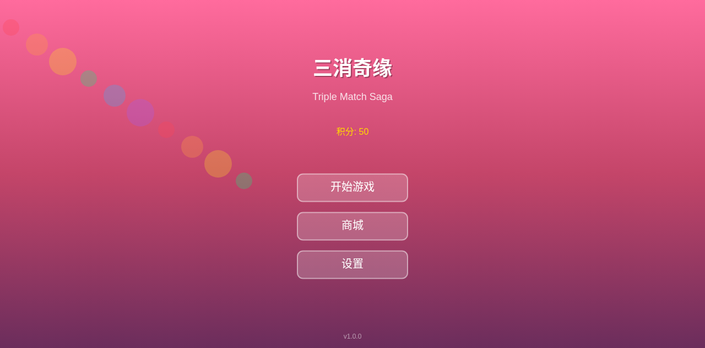
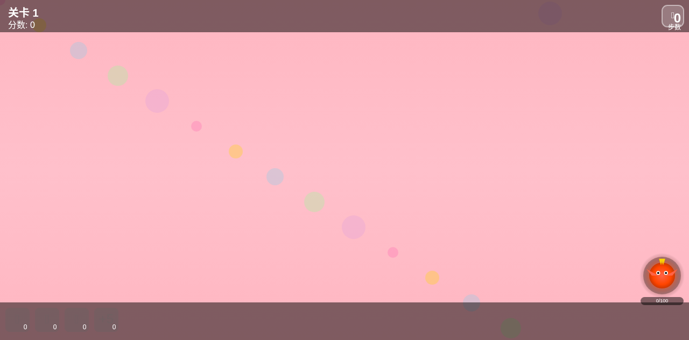
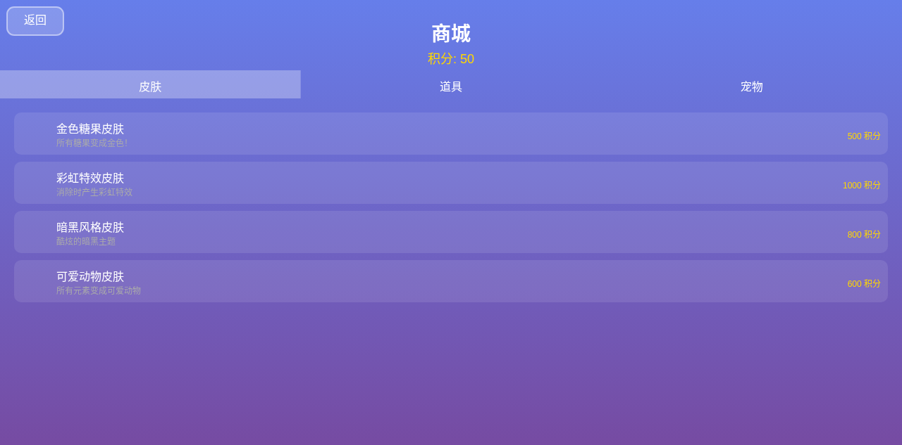

# 三消奇缘 - Triple Match Saga

一款创新的微信小游戏，融合三消、宠物战斗、Roguelike、合成进化等多种玩法。

## 特色功能

- **多主题关卡**：糖果/萌宠/甜点/水果四大主题，80+关卡
- **宠物战斗**：火龙/冰凤/雷猫三大宠物，消除充能释放技能
- **Roguelike**：每关随机修饰符，重力反转/毒雾/幸运星等10种
- **合成进化**：特殊糖果合成升级，毁灭之光全屏消除
- **彩蛋系统**：隐藏关卡/神秘宠物/节日惊喜
- **商城系统**：积分兑换皮肤/道具/宠物

## 游戏界面

### 主菜单



游戏启动后的主界面，包含：
- 游戏标题「三消奇缘」
- 开始游戏按钮
- 关卡选择入口
- 设置按钮

### 游戏界面



核心玩法界面，包含：
- **关卡信息**：当前关卡、分数、剩余步数
- **8x8棋盘**：可消除的糖果/动物/甜点/水果元素
- **宠物系统**：左下角宠物头像，消除充能释放技能
- **道具栏**：锤子、炸弹、刷新等辅助道具

### 商城系统



积分消费系统，包含：
- **皮肤商店**：金色糖果、彩虹特效、暗黑风格、可爱动物
- **道具商店**：锤子、炸弹、刷新、+5步、彩虹糖
- **宠物商店**：火龙、冰凤、雷猫、彩虹龙（稀有）

## 技术栈

- 纯Canvas渲染，无DOM依赖
- 微信小游戏API适配
- Web Audio音效
- 粒子系统特效

## 运行方式

### 微信小游戏

1. 下载微信开发者工具
2. 导入项目目录 `triple_match_saga`
3. 填入AppID（或在project.config.json中修改）
4. 点击编译运行

### Web预览

直接用浏览器打开 `index.html` 文件即可运行。

推荐使用本地服务器运行以获得最佳效果：

```bash
# 使用Python
python -m http.server 8080

# 或使用Node.js
npx serve .
```

然后访问 http://localhost:8080

## 项目结构

```
triple_match_saga/
├── game.json              # 微信小游戏配置
├── project.config.json    # 项目配置
├── game.js                # 微信小游戏入口
├── game_bundle.js         # 游戏打包文件
├── ads.json               # 广告配置
├── index.html             # Web预览入口
├── style.css              # 样式文件
├── screenshots/           # 游戏截图
│   ├── main_menu.png      # 主菜单截图
│   ├── gameplay.png       # 游戏界面截图
│   └── shop.png           # 商城界面截图
├── js/
│   ├── wechat.js          # 微信API适配
│   ├── sound.js           # 音效系统
│   ├── particles.js       # 粒子系统
│   ├── candy.js           # 糖果精灵绘制
│   ├── animals.js         # 动物精灵绘制
│   ├── desserts.js        # 甜点精灵绘制
│   ├── fruits.js          # 水果精灵绘制
│   ├── themes.js          # 主题管理
│   ├── board.js           # 棋盘系统
│   ├── pet.js             # 宠物系统
│   ├── roguelike.js       # Roguelike系统
│   ├── evolve.js          # 合成进化系统
│   ├── shop.js            # 商城系统
│   ├── eggs.js            # 彩蛋系统
│   ├── ui.js              # UI系统
│   └── main.js            # 主入口
└── README.md              # 说明文档
```

## 游戏玩法

### 基础玩法

1. 点击选择一个元素
2. 点击相邻元素进行交换
3. 匹配3个或更多相同元素即可消除
4. 在限定步数内达成目标即可过关

### 特殊元素

- **条纹糖果**：匹配4个生成，消除整行/列
- **包装糖果**：L型或T型匹配生成，消除周围3x3
- **彩色炸弹**：匹配5个生成，消除所有同色元素
- **毁灭之光**：两个彩色炸弹合成，全屏消除

### 宠物技能

- **火龙**：火焰吐息，消除一行元素
- **冰凤**：冰霜之翼，冻结随机元素
- **雷猫**：雷霆一击，随机消除5个元素
- **彩虹龙**：彩虹毁灭，消除所有元素（稀有）

### 商城系统

- **积分获取**：消除得分、连击加成、每日任务
- **皮肤购买**：金色糖果、彩虹特效、暗黑风格等
- **道具购买**：锤子、炸弹、刷新、+5步等
- **宠物购买**：火龙、冰凤、雷猫、彩虹龙

### 彩蛋系统

- **神秘关卡**：每10关后可能出现，元素全部变成金色
- **幸运转盘**：每天首次登录可获得随机奖励
- **连续登录**：连续登录获得特殊奖励
- **隐藏宠物**：第50关后可能发现稀有彩虹龙
- **节日彩蛋**：节假日特殊UI和奖励

## 配置说明

### 广告配置 (ads.json)

```json
{
  "rewardedVideoId": "adunit-xxx",  // 激励视频广告ID
  "interstitialId": "adunit-yyy",   // 插屏广告ID
  "bannerId": "adunit-zzz",         // Banner广告ID
  "enableAds": true                  // 是否启用广告
}
```

### 项目配置 (project.config.json)

修改 `appid` 字段为你的微信小游戏AppID。

## 开发说明

### 添加新主题

1. 在 `js/` 目录创建新的精灵绘制模块
2. 在 `themes.js` 中添加主题配置
3. 更新关卡配置

### 添加新宠物

1. 在 `pet.js` 的 `petConfigs` 中添加新宠物配置
2. 实现宠物的绘制函数
3. 在商城中添加宠物商品

### 添加新彩蛋

1. 在 `eggs.js` 的 `easterEggTypes` 中添加新彩蛋
2. 实现触发条件和效果

## 性能优化

- 使用离屏Canvas预渲染精灵
- 粒子数量限制
- 对象池复用
- 按需渲染

## 兼容性

- 微信小游戏基础库 2.25.3+
- iOS Safari 12+
- Android Chrome 70+
- 现代浏览器

## 开源协议

MIT License

## 贡献指南

欢迎提交Issue和Pull Request！

### 提交规范

- feat: 新功能
- fix: 修复bug
- docs: 文档更新
- style: 代码格式
- refactor: 重构
- test: 测试
- chore: 构建/工具

## 联系方式

如有问题或建议，欢迎提交Issue。

---

**三消奇缘 - Triple Match Saga**

一款充满乐趣的三消游戏，期待你的体验！
